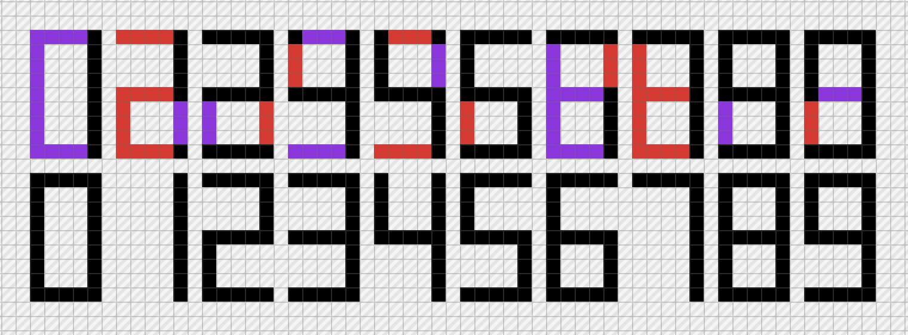

# ld45
Ludum Dare 45 - theme: "Start with nothing"

## Colors

<table>
  <tr>
    <th style="background: #FCB0B9">#FCB0B9</th>
    <th style="background: #FA8694">#FA8694</th>
    <th style="background: #F96173">#F96173</th>
    <td>Red</td>
  </tr>
  <tr>
    <th style="background: #FFE197">#FFE197</th>
    <th style="background: #FFD46B">#FFD46B</th>
    <th style="background: #F4C143">#F4C143</th>
    <td>Orange</td>
  </tr>
  <tr>
    <th style="background: #FFFDC5">#FFFDC5</th>
    <th style="background: #FFFC99">#FFFC99</th>
    <th style="background: #E6E25E">#E6E25E</th>
    <td>Yellow</td>
  </tr>
	<tr>
    <th style="background: #C5FFE0">#C5FFE0</th>
    <th style="background: #99FFC7">#99FFC7</th>
    <th style="background: #74FFB5">#74FFB5</th>
    <td>Green</td>
  </tr>
	<tr>
    <th style="background: #95DFFF">#95DFFF</th>
    <th style="background: #72D4FF">#72D4FF</th>
    <th style="background: #51CBFF">#51CBFF</th>
    <td>Light Blue</td>
  </tr>
  <tr>
    <th style="background: #98C5FF">#98C5FF</th>
    <th style="background: #77B3FF">#77B3FF</th>
    <th style="background: #58A1FF">#58A1FF</th>
    <td>Blue</td>
  </tr>
  <tr>
    <th style="background: #F3C3FF">#F3C3FF</th>
    <th style="background: #EA99FF">#EA99FF</th>
    <th style="background: #E475FF">#E475FF</th>
    <td>Purple</td>
  </tr>
</table>

​	

## Brainstorm

- Consumption
  - You have to eat resources which make you more exposed to risk.
- Avoidance
  - Someone is filling something you want to keep empty.
- Mutation
  - A counter increments when you pick things up, changing the landscape.
    
  - Every time you move, you add one to a counter.
- Growth
  - You curate a system growing in complexity.
- Feeding
  - You have to charge up something.
    - A lighthouse / lantern.
